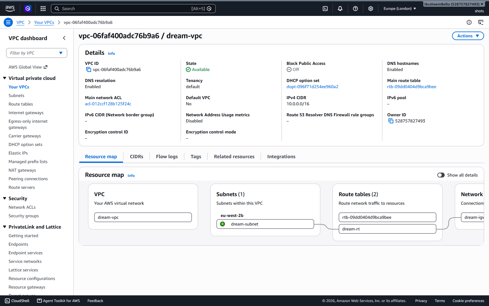
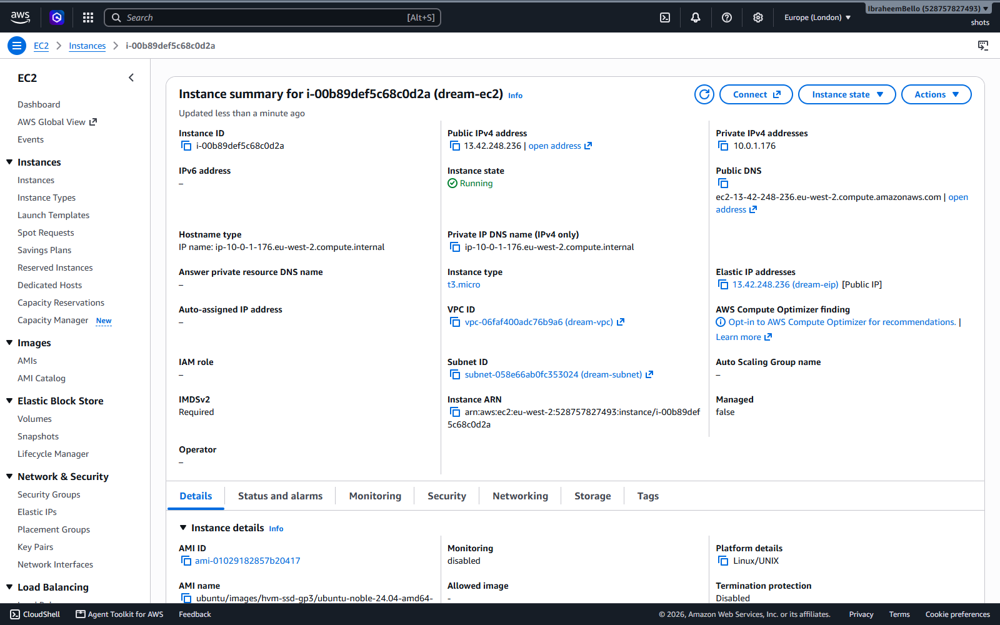
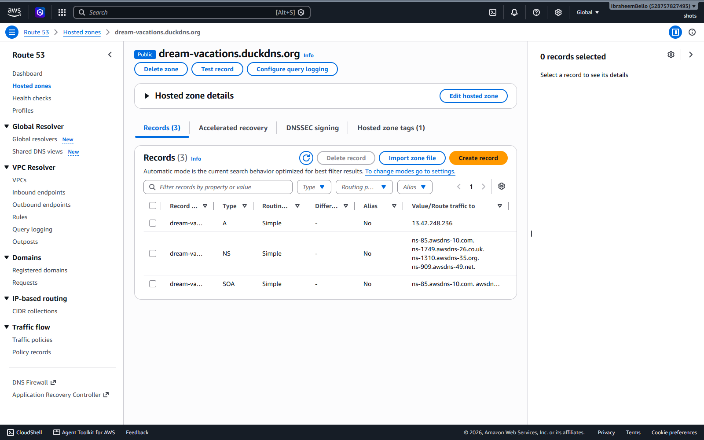
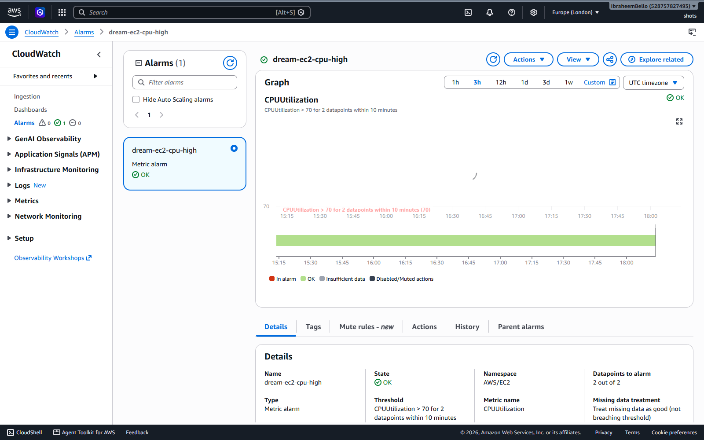
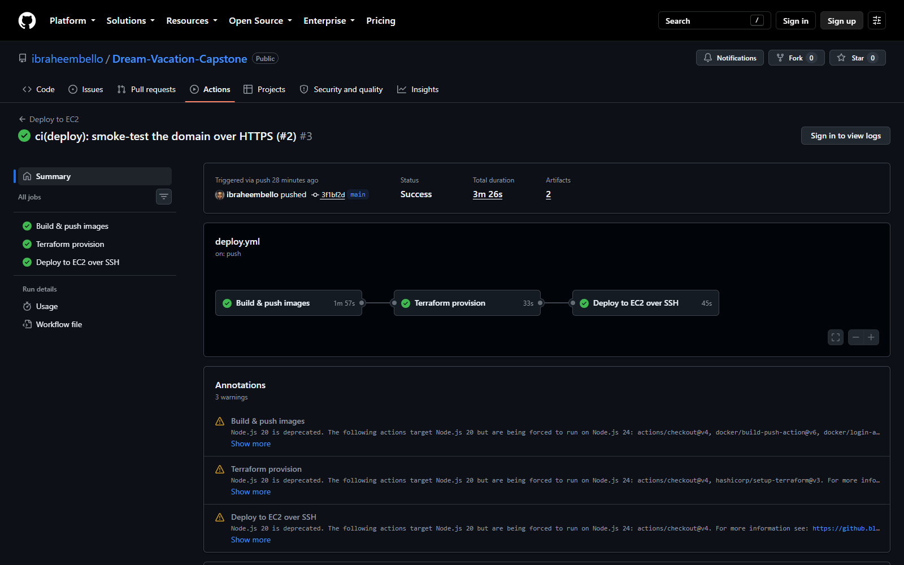

# 🌍 Dream Vacations: Capstone DevOps Deployment

[](https://github.com/ibraheembello/Dream-Vacation-Capstone/actions/workflows/ci.yml)
[](https://github.com/ibraheembello/Dream-Vacation-Capstone/actions/workflows/backend.yml)
[](https://github.com/ibraheembello/Dream-Vacation-Capstone/actions/workflows/frontend.yml)
[](https://github.com/ibraheembello/Dream-Vacation-Capstone/actions/workflows/deploy.yml)

> **Live app:** https://dream-vacations.duckdns.org

Capstone project for the 2026 DevOps track. It takes a full-stack travel booking
app (React frontend, Node.js API, PostgreSQL) and carries it all the way to
production on AWS: version control workflow, shell automation, containers, CI/CD,
Terraform infrastructure, a real domain, an Nginx reverse proxy, and HTTPS from
Let's Encrypt.

The application code comes from the company codebase at
[obusorezekiel/Dream-Vacation-App](https://github.com/obusorezekiel/Dream-Vacation-App).
This repository is built from scratch (it is **not** a fork); all of the DevOps
work below is original.

---

## 🎯 What this delivers

| Area | What was built |
|------|----------------|
| Git workflow | `main` + `dev` branches, PRs required, branch protection on `main` |
| Shell scripting | Idempotent scripts for env setup, DB backup with retention, and log rotation |
| Containers | Dockerfiles for backend and frontend, official Postgres image |
| Orchestration | `docker-compose.yml` (local) and `docker-compose.prod.yml` (EC2) |
| CI/CD | GitHub Actions: lint/test/build on PRs, image publish on merge to `main` |
| Infrastructure | Terraform: VPC, subnet, IGW, route table, security group, EC2, Route 53, remote state in S3 |
| Deployment | EC2 running the stack with Docker Compose, provisioned and rolled out by the pipeline |
| DNS | Free DuckDNS domain, A record to the EC2 Elastic IP |
| Reverse proxy + SSL | Host Nginx serving the frontend and proxying the API, HTTPS via Certbot with auto-renewal |
| Monitoring | CloudWatch CPU metric and alarm |

---

## 🧱 Architecture

```
                          Internet (https://dream-vacations.duckdns.org)
                                        │  443 / 80
                                        ▼
                        ┌───────────────────────────────┐
                        │   EC2 (Ubuntu 24.04, t3.micro) │
                        │                                │
                        │   ┌────────────────────────┐   │
                        │   │  Host Nginx (reverse    │   │
                        │   │  proxy + Let's Encrypt) │   │
                        │   └───────┬─────────┬───────┘   │
                        │      /    │         │  /api/    │
                        │           ▼         ▼           │
                        │   ┌───────────┐ ┌───────────┐   │
                        │   │ frontend  │ │ backend   │   │
                        │   │ React+nginx│ │ Node+Expr │   │
                        │   │ :8080 (lo)│ │ :3001 (lo)│   │
                        │   └───────────┘ └─────┬─────┘   │
                        │                       │ db:5432 │
                        │                 ┌─────▼─────┐   │
                        │                 │  Postgres │   │
                        │                 │  16 + vol │   │
                        │                 └───────────┘   │
                        └────────────────────────────────┘

   Containers publish on loopback only (127.0.0.1). The host Nginx is the single
   public entry point: it terminates TLS, serves the React app, and proxies /api/
   to the Node backend. All containers share the "dvapp-net" bridge network.
```

| Service    | Image / Build            | Exposure                     |
|------------|--------------------------|------------------------------|
| host Nginx | `nginx` (apt, on the VM) | public `80` and `443`        |
| `frontend` | multi-stage build, nginx | `127.0.0.1:8080` (loopback)  |
| `backend`  | `node:18-alpine`         | `127.0.0.1:3001` (loopback)  |
| `db`       | `postgres:16-alpine`     | internal only (`dvapp-net`)  |

---

## 📂 Project structure

```
Dream-Vacation-Capstone/
├── backend/
│   ├── Dockerfile              # Node API image (non-root, prod deps only)
│   ├── server.js
│   └── package.json
├── frontend/
│   ├── Dockerfile              # Multi-stage: node build, then nginx serve
│   ├── nginx.conf              # SPA routing + gzip + /api proxy (in-container)
│   └── src/ ...
├── db/
│   └── init.sql                # Creates the `destinations` table on first boot
├── scripts/
│   ├── setup-env.sh            # Install Docker + Compose, create .env (idempotent)
│   ├── db-backup.sh            # pg_dump + gzip + retention pruning
│   └── log-rotate.sh           # App log + Docker log rotation policy
├── deploy/
│   ├── remote-deploy.sh        # Runs on EC2 during a deploy (pull + up -d)
│   └── setup-ssl.sh            # Certbot issuance + auto-renewal on the host
├── infra/                      # Terraform (remote state in S3)
│   ├── network.tf              # VPC, subnet, IGW, route table
│   ├── ec2.tf                  # AMI, security group, instance, Elastic IP
│   ├── route53.tf              # Route 53 hosted zone + A record
│   ├── cloudwatch.tf           # CPU alarm
│   ├── variables.tf / outputs.tf / versions.tf
│   └── user-data.sh            # Installs Docker, Nginx, Certbot on first boot
├── docker-compose.yml          # Local orchestration (builds images)
├── docker-compose.prod.yml     # EC2 orchestration (pulls GHCR images)
├── .github/workflows/          # ci.yml, backend.yml, frontend.yml, deploy.yml
├── .env.example
└── README.md
```

---

## 🌿 Git workflow

- **Branches:** `main` is production (protected). `dev` is the integration branch.
  Feature branches are cut from `dev`.
- **Pull requests:** changes reach `main` only through a PR. Direct pushes to
  `main` are blocked by branch protection.
- **Required checks:** the `CI` workflow (Terraform validate + ShellCheck) plus the
  backend/frontend CI jobs must pass before a PR can merge.

---

## 🐚 Shell scripts

All scripts use `set -euo pipefail`, are executable, and are safe to run more than
once (idempotent).

```bash
# Prepare a fresh host: install Docker + Compose, create .env from the template
./scripts/setup-env.sh

# Back up the database (timestamped, gzip-compressed, prunes old dumps)
RETENTION_DAYS=7 ./scripts/db-backup.sh

# Install log rotation for app logs and cap Docker container log size
sudo ./scripts/log-rotate.sh
```

`db-backup.sh` is cron-friendly, for a nightly backup at 02:00:

```cron
0 2 * * *  /home/ubuntu/app/scripts/db-backup.sh >> /var/log/dream-vacations/backup.log 2>&1
```

---

## 🚀 Run it locally

### 1. Clone and configure

```bash
git clone https://github.com/ibraheembello/Dream-Vacation-Capstone.git
cd Dream-Vacation-Capstone
cp .env.example .env      # defaults work out of the box for local use
```

### 2. Start the stack with one command

```bash
docker compose up --build
```

The backend waits for PostgreSQL to be healthy before starting, so there is no
cold-start race. The `destinations` table is created automatically on first launch.

### 3. Open the app

| What        | URL                                    |
|-------------|----------------------------------------|
| Frontend    | http://localhost:3000                  |
| Backend API | http://localhost:3000/api/destinations |

---

## 🔍 Verify it's working

```bash
docker compose ps                                    # all Up, db healthy
curl -I http://localhost:3000                        # HTTP 200 from nginx
curl http://localhost:3000/api/destinations          # JSON from the API
docker compose exec db psql -U dreamuser -d dreamvacations -c "\dt"
```

Data survives restarts thanks to the named `db-data` volume. `docker compose down -v`
wipes it.

---

## 🔁 CI/CD (GitHub Actions)

Four workflows:

| Workflow        | Trigger                          | Job |
|-----------------|----------------------------------|-----|
| `ci.yml`        | every PR / push to `main`, `dev` | Terraform fmt + validate, ShellCheck |
| `backend.yml`   | `backend/**` changes             | lint, test, docker build; push image on merge |
| `frontend.yml`  | `frontend/**` changes            | lint, test, docker build; push image on merge |
| `deploy.yml`    | push to `main`                   | build images, Terraform apply, deploy to EC2 |

On a pull request the CI jobs run (lint, test, build) but nothing is published. On
merge to `main`, images are built and pushed to GHCR, then `deploy.yml` provisions
infra with Terraform and rolls the app onto EC2.

Images go to the **GitHub Container Registry** using the built-in `GITHUB_TOKEN`,
so there are no registry credentials to manage. To use Docker Hub instead, swap the
login step for `DOCKER_USERNAME` / `DOCKER_TOKEN` secrets.

---

## ☁️ Infrastructure with Terraform

Everything in `infra/` is created by `terraform apply` from the pipeline. State is
kept in an S3 bucket with native locking, so runs stay consistent across machines.

| Resource         | Name                 | Detail                                         |
|------------------|----------------------|------------------------------------------------|
| VPC              | `dream-vpc`          | `10.0.0.0/16`                                  |
| Subnet           | `dream-subnet`       | `10.0.1.0/24` (public, auto-assign IP)         |
| Internet Gateway | `dream-igw`          | attached to `dream-vpc`                         |
| Route Table      | `dream-rt`           | `0.0.0.0/0` to `dream-igw`, tied to the subnet  |
| Security Group   | `dream-sg`           | inbound `22` (SSH), `80` (HTTP), `443` (HTTPS) |
| EC2              | `dream-ec2`          | Ubuntu 24.04 LTS, `t3.micro`, Docker + Nginx via user-data |
| Elastic IP       | `dream-eip`          | stable public address for DNS and deploys      |
| Route 53 zone    | `dream-hosted-zone`  | public hosted zone + apex A record to the EIP  |
| CloudWatch alarm | `dream-ec2-cpu-high` | `CPUUtilization` > 70% for 10 min              |

### Networking (`infra/network.tf`)

```hcl
resource "aws_vpc" "dream" {
  cidr_block           = "10.0.0.0/16"
  enable_dns_support   = true
  enable_dns_hostnames = true
  tags                 = { Name = "dream-vpc" }
}

resource "aws_subnet" "dream" {
  vpc_id                  = aws_vpc.dream.id
  cidr_block              = "10.0.1.0/24"
  map_public_ip_on_launch = true
  tags                    = { Name = "dream-subnet" }
}

resource "aws_route_table" "dream" {
  vpc_id = aws_vpc.dream.id
  route {
    cidr_block = "0.0.0.0/0"
    gateway_id = aws_internet_gateway.dream.id
  }
  tags = { Name = "dream-rt" }
}
```

### Route 53 (`infra/route53.tf`)

```hcl
resource "aws_route53_zone" "dream" {
  name    = var.domain_name
  comment = "Dream Vacations capstone hosted zone (managed by Terraform)"
  tags    = { Name = "dream-hosted-zone" }
}

resource "aws_route53_record" "app" {
  zone_id = aws_route53_zone.dream.zone_id
  name    = var.domain_name
  type    = "A"
  ttl     = 300
  records = [aws_eip.dream.public_ip]
}
```

### CloudWatch (`infra/cloudwatch.tf`)

```hcl
resource "aws_cloudwatch_metric_alarm" "cpu_high" {
  alarm_name          = "dream-ec2-cpu-high"
  comparison_operator = "GreaterThanThreshold"
  evaluation_periods  = 2
  metric_name         = "CPUUtilization"
  namespace           = "AWS/EC2"
  period              = 300
  statistic           = "Average"
  threshold           = 70
  dimensions          = { InstanceId = aws_instance.dream.id }
}
```

Variables and outputs make the config reusable: `domain_name`, `instance_type`, and
`aws_region` are inputs; the EC2 IP, VPC ID, hosted zone ID, and zone nameservers
are outputs.

---

## 🌐 Domain and DNS

The live site uses a free **DuckDNS** subdomain, `dream-vacations.duckdns.org`, with
its A record pointed at the EC2 Elastic IP.

A note on Route 53: DuckDNS owns the `duckdns.org` parent zone and does not allow
delegating a subdomain's nameservers, so the public internet resolves the name
through DuckDNS rather than through Route 53. The Terraform-managed Route 53 hosted
zone and A record are still provisioned (requirement 6) and become authoritative the
moment the domain is swapped for a registrable one: point the registrar's
nameservers at the `route53_name_servers` output, no code change needed.

Update the DuckDNS record (also runs from a cron on the box to keep it current):

```bash
curl "https://www.duckdns.org/update?domains=dream-vacations&token=<TOKEN>&ip=<EC2_IP>"
```

---

## 🔒 Nginx reverse proxy and SSL

Nginx is installed on the host at boot (`infra/user-data.sh`) and fronts the app:

- `location /` proxies to the React frontend container on `127.0.0.1:8080`
- `location /api/` proxies to the Node backend container on `127.0.0.1:3001`

SSL is issued by Certbot / Let's Encrypt once the domain resolves to the box:

```bash
sudo DOMAIN=dream-vacations.duckdns.org EMAIL=you@example.com ./deploy/setup-ssl.sh
```

That script requests the certificate, adds the HTTP to HTTPS redirect, and enables
`certbot.timer` for automatic twice-daily renewal. Renewal is verified with
`certbot renew --dry-run`.

---

## 🔑 Required GitHub secrets

| Secret                  | Purpose                                            |
|-------------------------|----------------------------------------------------|
| `AWS_ACCESS_KEY_ID`     | lets the `terraform` job call AWS                  |
| `AWS_SECRET_ACCESS_KEY` | lets the `terraform` job call AWS                  |
| `EC2_SSH_PUBLIC_KEY`    | registered on the instance via `aws_key_pair`      |
| `EC2_SSH_KEY`           | matching private key for the `deploy` job's SSH    |
| `POSTGRES_PASSWORD`     | DB password written into the on-box `.env`         |
| `GITHUB_TOKEN`          | built-in, used to pull GHCR images on the box      |

---

## 📸 Deliverables

**VPC and subnet created by Terraform**


**EC2 instance running** (`dream-ec2`, `t3.micro`, Running, 3/3 checks)


**Route 53 hosted zone** (`dream-hosted-zone`, provisioned by Terraform)


**App live over HTTPS** (`https://dream-vacations.duckdns.org`)


**CloudWatch CPU metric and alarm** (`dream-ec2-cpu-high`)


**CI/CD pipeline run** (CI, Terraform, and deploy all green)


---

## 🧰 Technologies

- **Frontend:** React (Create React App), served by nginx
- **Backend:** Node.js + Express
- **Database:** PostgreSQL 16
- **Containerization:** Docker, Docker Compose
- **CI/CD:** GitHub Actions, GitHub Container Registry (GHCR)
- **Infrastructure as code:** Terraform, remote state in S3
- **Cloud:** AWS (VPC, EC2 `t3.micro`, Elastic IP, Route 53, CloudWatch)
- **Web server / TLS:** Nginx reverse proxy, Let's Encrypt via Certbot
- **DNS:** DuckDNS (free domain), Route 53 hosted zone
